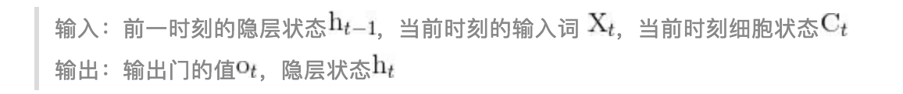

## overview

- $\text{Named Entity Recognition}$(**命名实体识别**)[^1]

  > 简称**NER**，是指识别文本中具有特定意义的实体，主要包括人名、地名、机构名、专有名词等，以及时间、数量、货币、比例数值等文字

  - 例如，对于如下句子

    > ACM宣布，深度学习的三位创造者Yoshua Bengio， Yann LeCun， 以及Geoffrey Hinton获得了2019年的图灵奖。

    NER的任务就是提取出

    - 机构名：ACM
    - 人名：Yoshua Bengio， Yann LeCun，Geoffrey Hinton
    - 时间：2019年
    - 专有名词：图灵奖

## 文本表示[^4]

- Word Embedding的优势
  - 将本文通过一个低维向量来表达，不像one-hot那么长
  - 词义相似的词在向量空间上也会比较相近
  - 通用性很强，可以用在不同的任务中
- `torch.nn.Embedding` 的理解[^5]

## CRF

### HMM[^6]

- 本质上是根据已知观测序列 $O \triangleq o_1 o_2 \cdots o_n$ 求解不可观测(状态)序列 $Q \triangleq q_1 \cdots q_n$ 的过程

- 我们需要构造状态转移矩阵 $A$ 和状态对观测的影响矩阵 $B$

- 那么我们只需要找到 $Q$，使得条件概率 $P(O | Q, A, B)$ 最大

- 求解方法为 **viterbi** 算法，实际上是简单的动态规划
  $$
  \begin{cases}
  状态表示: f[i, j] 
  \begin{cases}
  集合: 只考虑前 i 个观测值且最后一个状态为 j 的概率 \\
  属性: \max
  \end{cases} \\
  状态计算: f[i, j] = \max_{k \in 所有可取状态值} (f[i - 1, k] \times  A[k \rightarrow j] \times B[j \rightarrow o_i])
  \end{cases}
  $$

### CRF[^7]

## LSTM[^3]

### 计算过程[^2]

- 计算遗忘门

  

  

- 计算记忆门(输入门)

  

  

- 计算当前时刻细胞状态

  

  

- 计算输出门和当前时刻隐层状态

  

  

最终，我们可以得到与句子长度相同的隐层状态序列 $\lbrace h_0, h_1, \cdots , h_{n - 1} \rbrace$

### BiLSTM[^2]

## ref

[^1]: [命名实体识别](https://zhuanlan.zhihu.com/p/61227299)
[^2]: [详解BiLSTM及代码实现](https://zhuanlan.zhihu.com/p/47802053)
[^3]: [ML Lecture 21-1: Recurrent Neural Network (Part I)](https://www.youtube.com/watch?v=xCGidAeyS4M)

[^4]: [文本表示](https://easyai.tech/ai-definition/word-embedding/)
[^5]: [Pytorch学习笔记06---- torch.nn.Embedding 词嵌入层的理解](https://www.cnblogs.com/luckyplj/p/13377672.html)
[^6]: [HMM-隐马尔可夫模型详述](https://caojiangxia.github.io/HMM/)
[^7]: [Conditional Random Field Tutorial in PyTorch](https://towardsdatascience.com/conditional-random-field-tutorial-in-pytorch-ca0d04499463)
